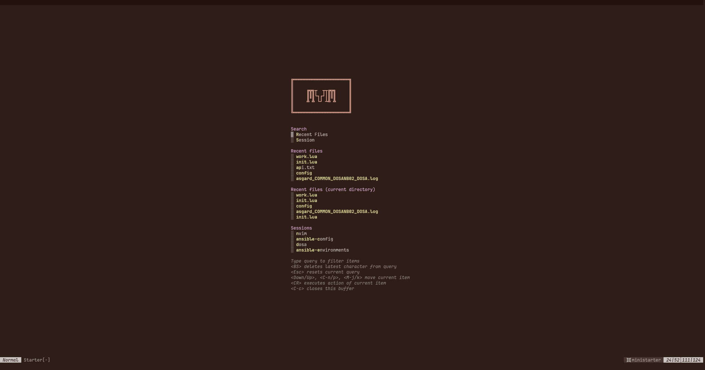
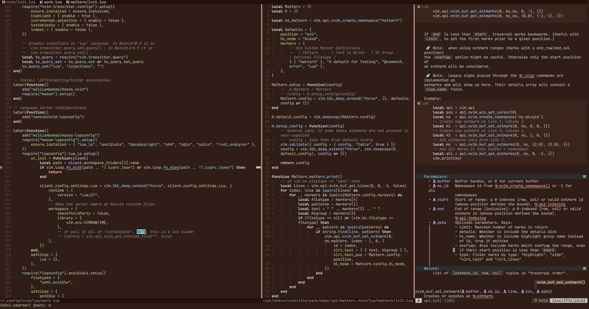

# MVIM

This is my NeoVim Configuration based entirely on [mini.nvim](https://github.com/echasnovski/mini.nvim)

## Why?
Mostly because it's a single plugin with most functionality i need. So i can easily scp this to Servers without Internet Connection and still have my entire NeoVim Setup.
Additionaly, I was getting tired of maintaining a Configuration with as many plugins as i did. I wanted to see what mini has to offer and it turned out it can basically replace all my other Plugins.

## Dependencies
This configuration should mostly work on it's own without anything else. To get it you need git (obviously).
I have provided a keymap for lazygit (`<leader>gl`), so you should install this if you want to use that.
I'm not going to go over how to get the tools you need to install LSPs. Others have done that much better already.

## Things to configure
Compared to nvim Distributions, this is mostly my personal Configuration as is. This also means that it contains some Settings, that probably don't work for you, or should be extended

### Hipatterns
I use mini.hipatterns to hide Passwords from files. This helps when screensharing in Meetings. This is based on matching a regex before the password. Please look at the hipatterns configuration
in my init.lua and add/remove patterns you don't need. Else this could lead to code being hidden.

### LSP Configuration
My LSP Configuration has been stripped from this Repo.
For my Setup, i include a "work.lua" File at the end of ini.lua. Feel free to also create one for your additional Pluins, or add them to the init file.

## Colorschemes
Mini.nvim provieds two different option to set up a colorscheme:
- mini.hues
- mini.base16
We currently load the `randomhue` theme on startup, which is based on mini.hues. If you want a specific colorscheme, and not a random one at start, configure it in the init file by uncommenting the mini.hues Block.

### mini.hues
This creates a colorscheme based on a background and foreground color. Alternatively it provides a "randomhues" colorscheme that randomizes the look with each call.
You can uncomment this in `init.lua`, if you want to use it.

### mini.base16
Here we can provide a [base16](https://github.com/chriskempson/base16) theme. The 16 colors are provided through the "palette" array.
You can uncomment this in `init.lua`, if you want to use it. It's set up with a basic `catppuccin` inspired Colorscheme.
This is also used to provide the themes in the "colors/" folder. If you want more than one theme, you can copy one of those and insert your own colors. This is also the way to get dark/light mode of the same theme.

## How Sessions Work
For now, you need to manualy create a Session first. You can start by editing a File and use `<SPC> s w` to create a new Session. It will automatically be named after PWD. Alternatively, type `:lua MiniSessions.write('Sessionname')` to create a session with a specific name.
After that you can start editing and using MVIM like you normaly would. On Quitting MVIM, the Session is saved. It'll show up on the Dashboard and you can get a Session selection with `<Leader>sf`.

## Unique things
Since this is my personal Configuration, there might be things that work differently from other distributions. I'm not going over keybinds mostly, as you can discover them through mini.clues (just press space, it shows up on the bottom right).
I did, however, rebind the umlaut "ö" to colon in normal and visual mode. It's the same spot where colon would be on a QWERTY keyboard. I just use a QWERTZ layout.
